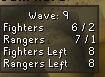

# BA Wave Info
- Displays Barbarian Assault wave info by role
- Shows NPC spawns and reserves per wave
- Optional tracking of remaining NPC spawns during waves

Future work:
- Improve healer tracking accuracy when NPCs leave and re-enter render distance
    - Current limitation: reappearing NPCs can be counted as new spawns
    - Potential solution: track NPC instances using a hashmap 