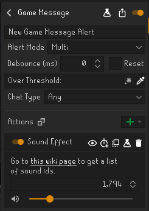
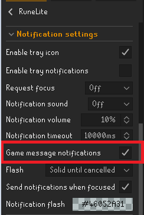

# DPS Threshold Alerts

A RuneLite plugin that alerts you when damage dealt to a target exceeds a configurable threshold.
Useful when alting bosses!

## Features

- Tracks individual hits
- Triggers an alert when damage exceeds your set threshold

## Watchdog Integration

For a more AFK-friendly setup, combine this plugin with Watchdog to play a sound whenever a hit exceeds your threshold.

Add the following text to your Watchdog game message alert:

```
Over threshold:
```

Then choose your preferred sound ID (for example, 1794 for the Tears of Guthix sound effect).




Make sure your game message notifications are enabled for the chatbox message to appear for watchdog!

